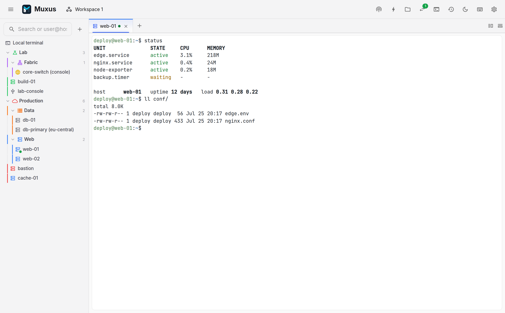

# Muxus

Muxus is a free, open-source SSH, Telnet and serial client. Split panes, saved workspaces,
SFTP, a remote editor, saved tunnels, and images in the terminal.

**The docs are the main entry point:** [flosch62.github.io/muxus](https://flosch62.github.io/muxus/)



## Start Here

- [Install Muxus](https://flosch62.github.io/muxus/install/)
- [Quickstart](https://flosch62.github.io/muxus/quickstart/)
- [User guide](https://flosch62.github.io/muxus/guide/)
- [Reference](https://flosch62.github.io/muxus/reference/)
- [Contributing and development](https://flosch62.github.io/muxus/community/)
- [Desktop releases](https://github.com/FloSch62/muxus/releases)

## Run From Source

Requires Node.js >= 24.20 and pnpm. Bun 1.4.0 is installed locally by pnpm;
the serial binding needs a C/C++ toolchain and Python 3. Desktop builds also need Go 1.26
and the platform webview libraries. See [building from source](https://flosch62.github.io/muxus/community/development/).

```bash
pnpm install
pnpm build
pnpm start
```

For development setup, architecture, the security model and how the screenshots are
generated, use the docs.

## Support

<a href="https://www.buymeacoffee.com/FloSch62">
  
</a>

## License

[MIT](./LICENSE)
