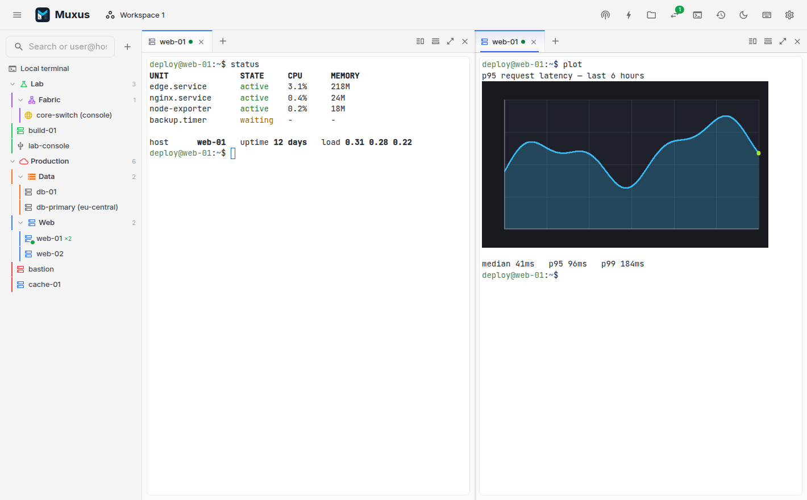
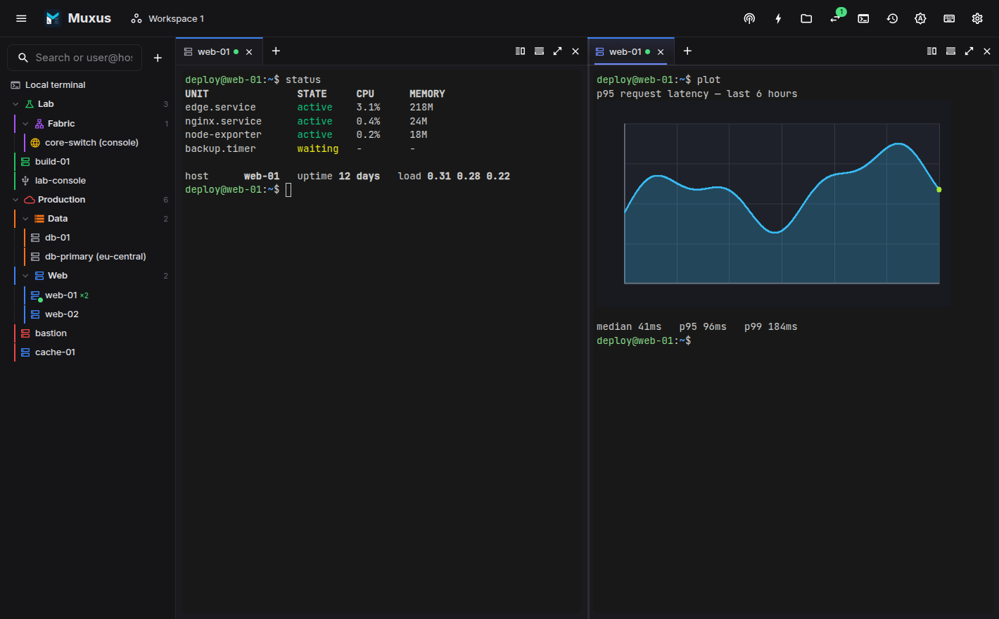

  <video class="only-light" poster="assets/screenshots/tour-poster.png"
         autoplay loop muted playsinline preload="metadata"
         aria-label="A tour of Muxus: opening a saved host, splitting the pane, a chart drawn in the terminal, the quick launcher, and a remote file open in the editor">
    <source src="assets/screenshots/tour.mp4" type="video/mp4">
  </video>
  <video class="only-dark" poster="assets/screenshots/tour-dark-poster.png"
         autoplay loop muted playsinline preload="metadata"
         aria-label="A tour of Muxus: opening a saved host, splitting the pane, a chart drawn in the terminal, the quick launcher, and a remote file open in the editor">
    <source src="assets/screenshots/tour-dark.mp4" type="video/mp4">
  </video>
  
  

## What it is

A desktop terminal client built around the session rather than the shell. Open a host to
get a terminal, then split it, drag a tab into the pane beside it, open the file browser,
edit a remote file in Monaco and start a tunnel. They all use the same connection, without
a second login. Save the arrangement as a workspace and reopen it tomorrow.

The terminal supports kitty graphics, so `kitten icat`, yazi previews and matplotlib render
inline over SSH. It also supports the kitty keyboard protocol, includes Nerd Font coverage
and comes with fifteen colour schemes.

Muxus reads every host from `~/.ssh/config`, while also letting you keep selected SSH hosts
in its local database without changing OpenSSH. Folders, colours, workspaces and history
use the same local database.

-   :material-file-cog-outline: **OpenSSH or Muxus-only**

    ---

    Every `Host` block appears in the sidebar, including files pulled in with `Include`.
    New and imported SSH hosts can instead stay entirely in Muxus app data.

    [:octicons-arrow-right-24: Your hosts](guide/hosts.md)

-   :material-image-outline: **Inline terminal images**

    ---

    The kitty graphics protocol renders `kitten icat`, yazi previews, matplotlib and timg
    inline, over SSH. Sixel and iTerm2 images work too.

    [:octicons-arrow-right-24: Images in the terminal](guide/graphics.md)

-   :material-view-split-vertical: **Split panes**

    ---

    ++ctrl+shift+left++ / ++ctrl+shift+right++ splits toward that side and reuses the
    connection. ++alt+left++ moves focus. Nothing is taken from the shell.

    [:octicons-arrow-right-24: Tabs & panes](guide/tabs-and-panes.md)

-   :material-transit-connection-variant: **Jump hosts and proxy commands**

    ---

    Nested `ProxyJump` chains dialled hop by hop, `ProxyCommand` transports, and the same
    agent → certificate → key → keyboard-interactive → password order `ssh` uses.

    [:octicons-arrow-right-24: Connecting](guide/connecting.md)

-   :material-folder-network-outline: **SFTP and remote editing**

    ---

    An SFTP browser per SSH tab on the same transport, and Monaco editing of remote files
    with real language services. No second login.

    [:octicons-arrow-right-24: File browser](guide/files.md)

-   :material-swap-horizontal: **Persistent tunnels**

    ---

    Saved `-L`, `-R` and `-D` forwards start with one click, without a terminal. Closing a
    tab never tears down a running tunnel.

    [:octicons-arrow-right-24: Tunnels](guide/tunnels.md)

-   :material-view-dashboard-outline: **Saved workspaces**

    ---

    Save a whole layout of local shells, SSH, Telnet and serial sessions in resizable panes
    with tabs. Reopen it, reconnect it, or set it as your startup workspace.

    [:octicons-arrow-right-24: Workspaces](guide/workspaces.md)

-   :material-magnify: **Quick launcher**

    ---

    ++ctrl+k++ searches saved hosts, open tabs, editor files, workspaces, commands, tunnels
    and retained session history, and acts on the result.

    [:octicons-arrow-right-24: Quick launcher](guide/quick-launcher.md)

## Get started

-   :material-download: **Install Muxus**

    ---

    Desktop installers for Windows, macOS and Linux, or run it from source.

    [:octicons-arrow-right-24: Installation](install/index.md)

-   :material-rocket-launch: **Quickstart**

    ---

    From a fresh install to a split-pane session on your own host in five minutes.

    [:octicons-arrow-right-24: Quickstart](quickstart.md)

## Made by

Muxus is built by me (FloSch), in the open and in my spare time. It is free and stays free.
If it saves you time, a coffee keeps the releases coming. [More about me](about.md).

[:simple-buymeacoffee: Buy me a coffee](https://www.buymeacoffee.com/FloSch62){ .md-button .md-button--primary }
[:material-star-outline: Star on GitHub](https://github.com/FloSch62/muxus){ .md-button }
