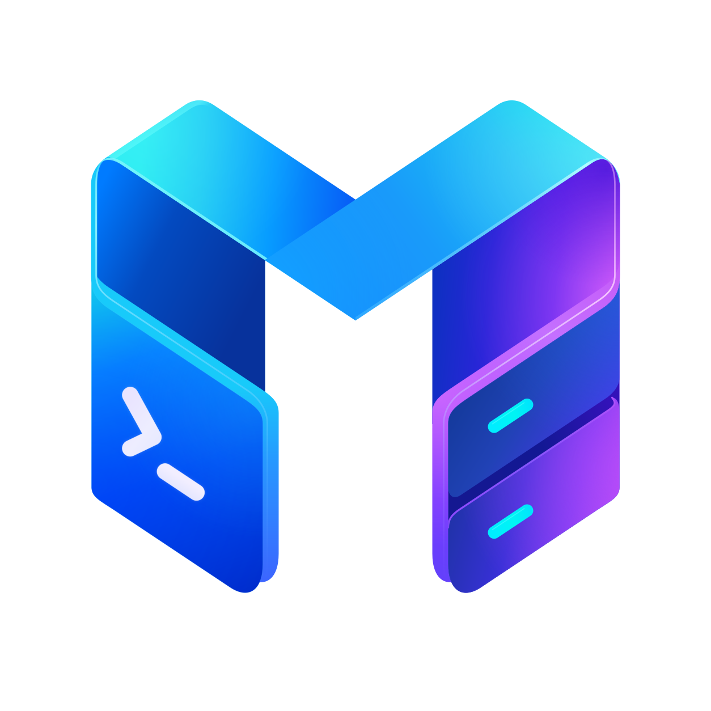

# { .muxus-hero-logo } Muxus

A free, open-source SSH, Telnet and serial client. Split panes, saved workspaces, SFTP,
a remote editor, saved tunnels, and images in the terminal.

[Get started :material-arrow-right:](install/index.md){ .md-button .md-button--primary }
[Download :simple-github:](https://github.com/FloSch62/muxus/releases){ .md-button }

  <video class="only-light" poster="assets/screenshots/tour-poster.png"
         autoplay loop muted playsinline preload="metadata"
         aria-label="A tour of Muxus: opening a saved host, splitting the pane, a chart drawn in the terminal, the quick launcher, and a remote file open in the editor">
    <source src="assets/screenshots/tour.mp4" type="video/mp4">
  </video>
  <video class="only-dark" poster="assets/screenshots/tour-dark-poster.png"
         autoplay loop muted playsinline preload="metadata"
         aria-label="A tour of Muxus: opening a saved host, splitting the pane, a chart drawn in the terminal, the quick launcher, and a remote file open in the editor">
    <source src="assets/screenshots/tour-dark.mp4" type="video/mp4">
  </video>
  
  

## What it is

A desktop terminal client built around the session rather than the shell. Open a host and
you get a terminal — then split it, drag a tab into the pane beside it, open the file
browser, edit a remote file in Monaco and start a tunnel, all over the same connection and
without a second login. Save the arrangement as a workspace and reopen it tomorrow.

The terminal is a current one: kitty graphics, so `kitten icat`, yazi previews and
matplotlib render inline over SSH, plus the kitty keyboard protocol, bundled Nerd Font
coverage and fifteen colour schemes.

Hosts come from `~/.ssh/config` — Muxus reads it, resolves it, and writes edits back into
it, so the list is the same one `ssh` uses. Folders, colours, workspaces and history go in
a local database, because OpenSSH has no field for them.

-   :material-file-cog-outline: **Your ssh config, not ours**

    ---

    Every `Host` block appears in the sidebar, including the files pulled in with
    `Include`. Edits are written back in place, atomically, with a `.muxus.bak`.

    [:octicons-arrow-right-24: Your hosts](guide/hosts.md)

-   :material-image-outline: **A terminal that draws**

    ---

    The kitty graphics protocol renders `kitten icat`, yazi previews, matplotlib and timg
    inline, over SSH. Sixel and iTerm2 images work too.

    [:octicons-arrow-right-24: Images in the terminal](guide/graphics.md)

-   :material-view-split-vertical: **Panes without the prefix dance**

    ---

    ++ctrl+shift+left++ / ++ctrl+shift+right++ splits toward that side and reuses the
    connection. ++alt+left++ moves focus. Nothing is taken from the shell.

    [:octicons-arrow-right-24: Tabs & panes](guide/tabs-and-panes.md)

-   :material-transit-connection-variant: **Full connect-through**

    ---

    Nested `ProxyJump` chains dialled hop by hop, `ProxyCommand` transports, and the same
    agent → certificate → key → keyboard-interactive → password order `ssh` uses.

    [:octicons-arrow-right-24: Connecting](guide/connecting.md)

-   :material-folder-network-outline: **Files and an editor, in the session**

    ---

    An SFTP browser per SSH tab on the same transport, and Monaco editing of remote files
    with real language services. No second login.

    [:octicons-arrow-right-24: File browser](guide/files.md)

-   :material-swap-horizontal: **Tunnels that outlive terminals**

    ---

    Saved `-L`, `-R` and `-D` forwards start with one click, without a terminal. Closing a
    tab never tears down a running tunnel.

    [:octicons-arrow-right-24: Tunnels](guide/tunnels.md)

-   :material-view-dashboard-outline: **Workspaces you can come back to**

    ---

    Save a whole layout of local shells, SSH, Telnet and serial sessions in resizable panes
    with tabs. Reopen it, reconnect it, or set it as your startup workspace.

    [:octicons-arrow-right-24: Workspaces](guide/workspaces.md)

-   :material-magnify: **One key for everything**

    ---

    ++ctrl+k++ searches saved hosts, open tabs, editor files, workspaces, commands, tunnels
    and retained session history, and acts on the result.

    [:octicons-arrow-right-24: Quick launcher](guide/quick-launcher.md)

## Get started

-   :material-download: **Install Muxus**

    ---

    Desktop installers for Windows, macOS and Linux, or run it from source.

    [:octicons-arrow-right-24: Installation](install/index.md)

-   :material-rocket-launch: **Quickstart**

    ---

    From a fresh install to a split-pane session on your own host in five minutes.

    [:octicons-arrow-right-24: Quickstart](quickstart.md)

