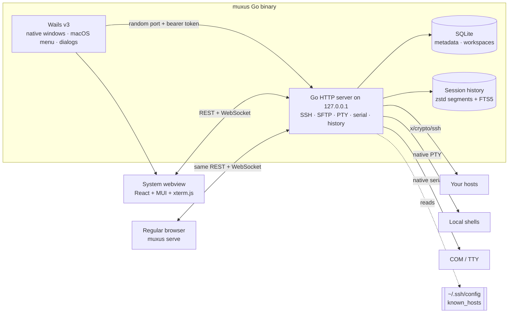

# Architecture

Muxus is a single Go executable with two entry points: the Wails desktop
shell and `muxus serve` browser mode. Both use the same authenticated Go HTTP
router and the same embedded React client.



Desktop mode starts the server on a random loopback port and loads that
origin in WebView2, WKWebView or WebKitGTK. Wails' HTTP transport is mounted
at `/wails/runtime` on the same router. Browser mode omits the native runtime
but otherwise remains a first-class deployment.

## Packages

| Package | What it is |
| --- | --- |
| `app/` | The Go executable: chi router, bearer/origin checks, SQLite migrations, line-preserving OpenSSH config engine, `x/crypto/ssh` connection leases, host-key verification, local PTY, Telnet, serial, SFTP, forwards, session history and Wails lifecycle. |
| `shared/` | TypeScript REST DTOs and zod-validated WebSocket protocol. On `/ws/terminal`, binary frames are bytes and text frames are control messages. |
| `client/` | React 19 + MUI. A flat pane canvas over a split tree, one declarative keymap, xterm.js with Image Addon and native kitty keyboard support. |
| `tests/` | Client/shared vitest units plus fixtures validated by both zod and `app/internal/api`, preventing wire-contract drift. |

The production client is precompressed and embedded with `go:embed`, so the
release has one executable and does not ship a JavaScript runtime or browser
engine.

## Design decisions

**The pane canvas is flat.** Panes, tab contents and dividers are siblings in
one absolutely positioned layer, each keyed by its own id. Reshaping the tree
only moves boxes, so terminals are never unmounted.

**Connections are leased.** One SSH transport serves every consumer that
requests the same host: extra terminals, SFTP, the remote editor and
forwards. A saved tunnel takes its own lease and survives terminal closure.

**The config is a document, not a model.** The parser records which lines in
which file each block owns, so edits preserve comments, ordering and
unmodelled options. Writes are atomic with a `.muxus.bak`.

**Session history is separate.** A dedicated goroutine writes framed raw
events into rotated zstd segments and batches searchable text into a
separate FTS5 database. Bounded queuing keeps persistence off the terminal
data path.

**Graphics stream rather than buffer.** Kitty APC sequences flow from
xterm.js into the Image Addon. Muxus adds no second parser or per-chunk
scheduling queue.

**Keys are one table.** Commands across panes, tabs, terminals and the
application use one keymap. A command that is not applicable falls through
to the shell.

## Data flow of one SSH session

1. The client sends a profile through `/ws/terminal`.
2. Go resolves the target through `ssh_config`, including ProxyJump or
   ProxyCommand.
3. Each hop is dialled with host-key verification and OpenSSH-order
   authentication; prompts travel as validated text control frames.
4. A shell channel opens and binary frames carry bytes in both directions.
5. Resize, logging and status use text frames mirrored in both languages.
6. Leases keep the transport available to SFTP and forwards until its last
   consumer releases it.

## Build

```bash
pnpm build      # shared + client + embedded, stripped Go executable
pnpm package    # portable release archive for this platform
pnpm test       # TypeScript client/shared/contract tests
pnpm test:go    # Go backend/transport/contract tests
pnpm lint
pnpm typecheck
```

Linux builds and tests use `-tags gtk3` for WebKitGTK 4.1 compatibility.
