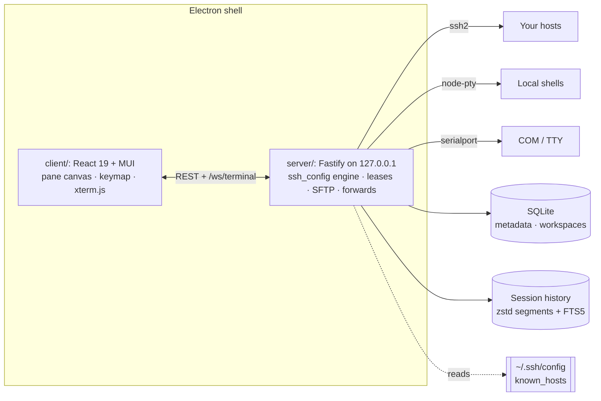

# Architecture

Muxus is a pnpm workspace of four TypeScript/ESM packages plus a test package: a Fastify
server on loopback, a React client, and an Electron shell that embeds both.



## Packages

| Package | What it is |
| --- | --- |
| `shared/` | REST DTOs and the zod-validated WebSocket protocol. On `/ws/terminal`, **binary frames are bytes** and **text frames are control messages**, with no framing layered on top of either. |
| `server/` | Fastify bound to `127.0.0.1` with a per-run bearer token; a versioned SQLite database; the line-preserving `ssh_config` parser/resolver/editor; leased `ssh2` transports with ProxyJump and OpenSSH-order authentication; `known_hosts` verification; `node-pty` local shells; Telnet negotiation; cross-platform `serialport` access; SFTP routes and the forward manager; the session-history worker. |
| `client/` | React 19 + MUI. A **flat pane canvas over a split tree**, so layout changes never remount a session; one declarative keymap dispatched ahead of the terminal; xterm.js with the Image Addon and native kitty keyboard support. |
| `electron/` | The hardened desktop shell: embeds the server in-process, bridges bootstrap credentials through an isolated preload, blocks unexpected navigation. |
| `tests/` | vitest units for the security and auth boundaries, persistence and migrations, connection leases, workspace and pane behaviour, SFTP overwrite policy, paste safety and the terminal protocols. |

## Design decisions

**The pane canvas is flat.** Panes, tab contents and dividers are siblings in one
absolutely positioned layer, each keyed by its own id. Reshaping the tree only moves boxes,
so terminals are never unmounted, and splitting, closing and moving tabs cannot disturb a
running shell, its scrollback, or its SSH channel.

**Connections are leased.** One SSH transport serves every consumer that requests the same
host: extra terminals, the SFTP panel, the remote editor, ad-hoc forwards. A saved tunnel
takes its own lease and survives the closing of every terminal.

**The config is a document, not a model.** The parser records which lines in which file
each block owns, so an edit rewrites those lines and nothing else. Comments, ordering and
unmodelled options are preserved. Writes are atomic with a `.muxus.bak`.

**Session history is not in the application database.** A dedicated worker writes framed raw
events into rotated zstd segments and batches normalized transcript chunks into a separate
FTS5 database, with its own quota, eviction and recovery. The recorder never blocks a
terminal.

**Graphics stream rather than buffer.** Kitty APC sequences flow from xterm.js 6.1 into the
Image Addon: chunked payloads are parsed incrementally, base64 decoding runs through
WebAssembly, and images render as terminal-buffer-aware canvas layers. Muxus adds no second
parser and no per-chunk scheduling queue.

**Keys are one table.** Every command across panes, tabs, terminal and application is a
keymap entry with default chords, dispatched before the terminal sees the event. A command
that is not applicable returns "not handled", and the key falls through to the shell.

## Data flow of one session

1. The client asks the server to resolve the target through `ssh_config`.
2. The server dials it, hop by hop for a jump chain, verifying host keys and running the
   OpenSSH authentication order, prompting through the socket when input is required.
3. A shell channel opens; **binary frames** carry bytes in both directions.
4. Resize, logging control and status arrive as **text frames** validated by the shared zod
   schema.
5. The lease keeps the transport alive for the file browser, the editor and any forwards
   until the last consumer releases it.

## Build

```bash
pnpm build      # shared → server → client → electron
pnpm test       # vitest
pnpm lint       # oxlint
pnpm typecheck
```

CI runs typecheck, lint, tests and bundle budgets, then builds unpacked desktop packages on
Linux, macOS and Windows.
